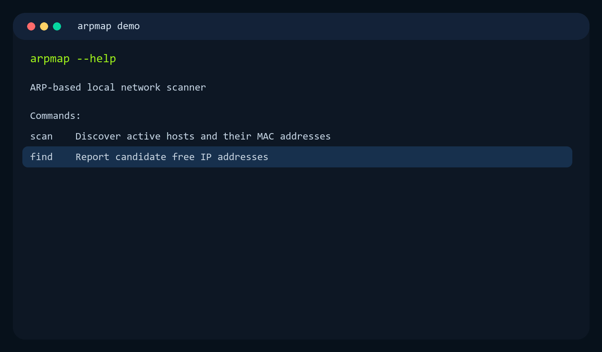

# arpmap

[](https://github.com/marko-stanojevic/arpmap/actions/workflows/ci.yml)
[](https://github.com/marko-stanojevic/arpmap/actions/workflows/release.yml)
[](https://github.com/marko-stanojevic/arpmap/releases/latest)
[](https://github.com/marko-stanojevic/arpmap/actions/workflows/ci.yml)
[](https://go.dev/)
[](#platform-support)



`arpmap` is a cross-platform CLI for ARP-based host discovery on local IPv4 subnets.

It provides two primary workflows:

- `scan`: discover responding hosts and write `IP -> MAC` mappings to JSON.
- `find`: identify candidate free IP addresses that did not respond to ARP probes.

## About

`arpmap` is designed for fast Layer-2 visibility on networks where ICMP or higher-layer probes may be filtered, rate-limited, or disabled.

- It resolves active non-loopback interfaces and scans every IPv4 host address in each attached subnet.
- Linux and macOS use raw Ethernet capture backends for request fan-out and ARP reply collection.
- Windows uses the native `SendARP()` API and does not require CGO.
- Output is written as structured JSON for easy automation and post-processing.
- Worker count and probe attempts are configurable per command.
- Debug mode prints scan parameters, timing summaries, response metrics, and sample response/no-response addresses.

## Requirements

- Linux/macOS with permissions for raw sockets (`root` or `CAP_NET_RAW`)
- Windows scan/find support via native `SendARP()` (`iphlpapi.dll`) without CGO

## Platform Support

- Linux: `scan` and `find` via raw `AF_PACKET` sockets
- macOS: `scan` and `find` via BPF
- Windows: `scan` and `find` via native `SendARP()` probes

## Installation

### Release binaries

Download the latest archive for your platform from the GitHub Releases page, extract it, and place `arpmap` somewhere on your `PATH`.

Example for Linux/macOS:

```bash
tar -xzf arpmap_X.Y.Z_linux_amd64.tar.gz
sudo install arpmap /usr/local/bin/arpmap
arpmap --help
```

Example for Windows PowerShell:

```powershell
Expand-Archive .\arpmap_X.Y.Z_windows_amd64.zip -DestinationPath .\arpmap
.\arpmap\arpmap.exe --help
```

### Ubuntu and Debian

Install from a released `.deb` package:

```bash
wget https://github.com/marko-stanojevic/arpmap/releases/download/vX.Y.Z/arpmap_X.Y.Z_linux_amd64.deb
sudo apt install ./arpmap_X.Y.Z_linux_amd64.deb
```

## Quick Start

The commands below assume `arpmap` is already installed from a release artifact and available on your `PATH`.

```bash
# show CLI help
arpmap --help

# scan all eligible interfaces
sudo arpmap scan --output devices.json

# find free IPs (all interfaces, no limit)
sudo arpmap find --output free_ips.json

# scan a specific interface with debug output
sudo arpmap scan --interface eth0 --debug --output devices.json

# find 10 candidate free addresses with a custom worker count
sudo arpmap find --interface eth0 --count 10 --workers 128 --output free_ips.json
```

Windows PowerShell examples:

```powershell
.\arpmap.exe scan --interface "Wi-Fi" --output devices.json
.\arpmap.exe scan --interface "Wi-Fi" --debug --workers 120 --attempts 1
.\arpmap.exe find --interface "Wi-Fi" --count 10 --output free_ips.json
```

## Commands

### `scan`

```bash
arpmap scan --interface eth0 --output devices.json
arpmap scan --output devices.json
arpmap scan --interface eth0 --debug --workers 128 --attempts 1
```

Important flags:

- `-i, --interface`: scan a specific interface by name
- `-o, --output`: output JSON path, default `devices.json`
- `--debug`: print timing, response metrics, and sampled response/no-response IPs
- `-w, --workers`: concurrent probe workers, `0` uses the platform default
- `-a, --attempts`: ARP probe attempts per target, default `1`

Sample output:

```json
{
  "interfaces": [
    {
      "interface": "eth0",
      "subnet": "192.168.1.0/24",
      "devices": [
        { "ip": "192.168.1.1", "mac": "dc:a6:32:00:11:02" },
        { "ip": "192.168.1.10", "mac": "48:21:0b:22:7f:31" },
        { "ip": "192.168.1.44", "mac": "84:3a:4b:10:45:99" }
      ]
    },
    {
      "interface": "wlan0",
      "subnet": "10.0.0.0/24",
      "devices": [
        { "ip": "10.0.0.1", "mac": "3c:52:82:2a:91:10" },
        { "ip": "10.0.0.23", "mac": "f0:2f:74:88:1d:6c" }
      ]
    }
  ]
}
```

### `find`

```bash
arpmap find --interface eth0 --count 10 --output free_ips.json
arpmap find --output free_ips.json
arpmap find --interface eth0 --count 10 --debug --attempts 1
```

Important flags:

- `-i, --interface`: scan a specific interface by name
- `-o, --output`: output JSON path, default `free_ips.json`
- `-c, --count`: maximum number of free IPs to return per subnet, `0` returns all
- `--debug`: print timing, response metrics, and sampled response/no-response IPs
- `-w, --workers`: concurrent probe workers, `0` uses the platform default
- `-a, --attempts`: ARP probe attempts per target, default `1`

Sample output:

```json
{
  "interfaces": [
    {
      "interface": "eth0",
      "subnet": "192.168.1.0/24",
      "free_ips": [
        "192.168.1.120",
        "192.168.1.121",
        "192.168.1.122",
        "192.168.1.131"
      ]
    },
    {
      "interface": "wlan0",
      "subnet": "10.0.0.0/24",
      "free_ips": [
        "10.0.0.88",
        "10.0.0.91",
        "10.0.0.109"
      ]
    }
  ]
}
```

`find` performs an ARP scan first, then reports addresses that did not respond. When `--count` is set, the scan can stop early once enough candidate free addresses have been identified.

## Debug Output

`--debug` is intended for operator troubleshooting and performance tuning. It prints scan settings, timing summaries, response counts, and sampled response/no-response IP addresses.

Example:

```text
[INFO] Scanning interface Wi-Fi (192.168.1.0/24)
[DEBUG] workers=64 attempts=1 targets=254
[DEBUG] sample responding IPs: 192.168.1.1, 192.168.1.10, 192.168.1.20
[DEBUG] sample non-responding IPs: 192.168.1.101, 192.168.1.102, 192.168.1.103
[DEBUG] total_duration=2.14s responses=18 no_responses=236
```

## Platform Implementation

Backends by platform:

- Linux: raw `AF_PACKET` socket with ARP filter attachment
- macOS: BPF device backend
- Windows: native `SendARP()` probing with per-target retry control

## Performance

`arpmap` favors fast fan-out with predictable completion behavior.

- Default workers:
  - Linux/macOS: `256`
  - Windows: `64`
- Default probe attempts: `1`
- Reply collection window for raw-socket backends: `2s` after probe dispatch completes
- Read polling deadline for raw-socket backends: `200ms`
- Retry spacing between repeated probes: `150ms`

Practical implication:

- Linux/macOS `/24` networks are typically handled in a single dispatch wave with default settings.
- Windows throughput depends more directly on `SendARP()` latency and worker count.
- Increasing `--workers` can reduce wall-clock time, but setting it too high may reduce stability on slower networks or hosts.
- Increasing `--attempts` may improve discovery on noisy networks at the cost of extra runtime.

To measure speed on your environment:

```bash
time sudo arpmap scan --interface eth0 --output devices.json
```

## Packaging

- GitHub releases publish macOS/Linux archives, Windows zip archives, Debian `.deb` packages, and `checksums.txt`.
- Debian packages are generated with GoReleaser nFPM packaging.

## Documentation

- [Getting Started](docs/getting-started.md)
- [Architecture](docs/architecture.md)
- [CI/CD & Release Guide](docs/ci-cd.md)
- [Contributing](CONTRIBUTING.md)

## Contributing

See [CONTRIBUTING.md](CONTRIBUTING.md).
